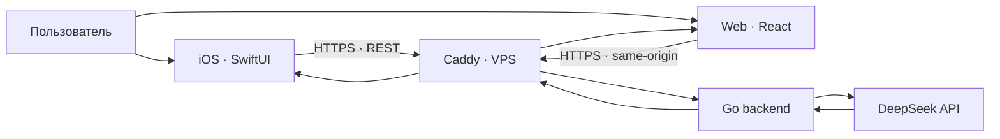

# AI Advent Challenge #9

### Практический путь от первого запроса к LLM до полноценного AI-продукта

[](https://github.com/eugeneappledev-source/AI-Challenge/actions/workflows/backend.yml)
[](https://github.com/eugeneappledev-source/AI-Challenge/actions/workflows/web.yml)


Этот репозиторий — мой практический дневник **AI Advent Challenge, поток 9**. Здесь одно приложение постепенно развивается вместе с заданиями курса: от минимальной интеграции с облачной моделью до более сложной архитектуры, инфраструктуры и пользовательских сценариев.

## Прогресс

| Неделя | День | Задание | Результат | Статус |
|:---:|:---:|---|---|:---:|
| 1 | [01](challenges/day-01/README.md) | Первый запрос к облачной LLM | SwiftUI + Go + DeepSeek + VPS | ✅ |
| 1 | [02](challenges/day-02/README.md) | Управление форматом ответа | Сравнение свободного и контролируемого ответов | ✅ |
| 1 | [03](challenges/day-03/README.md) | Разные способы рассуждения | Четыре стратегии решения и AI-арбитр | ✅ |
| 1 | [04](challenges/day-04/README.md) | Температура генерации | Три значения temperature и AI-рецензент | ✅ |
| 1 | [05](challenges/day-05/README.md) | Версии моделей | Три модели: качество, скорость, токены и стоимость | ✅ |
| 2 | [06](challenges/day-06/README.md) | Первый агент | Отдельная сущность Agent и SwiftUI-интерфейс | ✅ |
| 2 | [07](challenges/day-07/README.md) | Сохранение контекста | SQLite и восстановление истории | ✅ |
| 2 | [08](challenges/day-08/README.md) | Работа с токенами | Метрики контекста, ответа и стоимости | ✅ |
| 2 | [09](challenges/day-09/README.md) | Сжатие истории | Summary + последние N сообщений и A/B-рецензия | ✅ |
| 2 | [10](challenges/day-10/README.md) | Стратегии контекста | Настраиваемый N, Sliding Window, Sticky Facts и Branching | ✅ |
| 3 | [11](challenges/day-11/README.md) | Модель памяти агента | Три раздельных слоя и объяснимая маршрутизация | ✅ |
| 3 | [12](challenges/day-12/README.md) | Персонализация ассистента | Профили, ограничения и skill pipelines | ✅ |
| 3 | [13](challenges/day-13/README.md) | Состояние задачи | Task State Machine, pause/resume и persistence | ✅ |

Подробная навигация по выполненным заданиям находится в [дневнике челленджа](challenges/README.md).

## Быстрая проверка

Репозиторий построен как один развивающийся продукт, поэтому проверяющему не нужно искать отдельный проект для каждого дня:

1. открыть нужный день в таблице прогресса выше;
2. прочитать результат, условия эксперимента и способ проверки;
3. перейти по ссылкам из раздела **«Код»** к конкретным iOS- и backend-файлам;
4. при необходимости открыть тег `day-XX` — он сохраняет проект ровно в состоянии соответствующей сдачи.

Дни не перезаписывают друг друга: в iOS-приложении каждый сценарий открывается отдельным экраном из общего каталога, а обратная совместимость API отмечена в описаниях заданий.

## Текущая версия проекта

Нативное iOS-приложение сохраняет каталог заданий первых двух недель. Первая неделя исследует базовый API-вызов, управляемый JSON, способы рассуждения, `temperature` и версии моделей. Вторая неделя строит самостоятельного агента Compass, добавляет ему SQLite-память, token/cost-метрики, summary-компрессию и три переключаемые стратегии контекста без summary. С третьей недели интерактивные лаборатории развиваются в адаптивной Web-версии: День 11 добавляет три слоя памяти, День 12 — пользовательские профили и pipeline навыков, День 13 — сохраняемый конечный автомат задачи с паузой и продолжением без повторного объяснения. Предыдущие Web-сценарии остаются доступны через переключатель на сайте.

Проект развёрнут на VPS и доступен по HTTPS без регистрации.

- **Web-приложение:** [https://176-53-173-246.sslip.io](https://176-53-173-246.sslip.io)
- **Health check:** [https://176-53-173-246.sslip.io/health](https://176-53-173-246.sslip.io/health)

## Архитектура



## Структура

```text
AI-Challenge/
├── ios/                         # iOS-приложение
├── web/                         # адаптивное React-приложение
├── backend/                     # Go REST API
├── deploy/                      # Docker Compose и Caddy
├── challenges/                  # дневник выполненных заданий
│   ├── day-01/                  # первый запрос к LLM
│   ├── day-02/                  # контроль формата и длины ответа
│   ├── day-03/                  # четыре стратегии рассуждения
│   ├── day-04/                  # эксперимент с temperature
│   ├── day-05/                  # сравнение версий моделей
│   ├── day-06/                  # отдельная сущность первого агента
│   ├── day-07/                  # постоянная память в SQLite
│   ├── day-08/                  # токены, стоимость и переполнение
│   ├── day-09/                  # summary и последние N сообщений
│   ├── day-10/                  # Window, Facts и Branching
│   ├── day-11/                  # три слоя памяти и Memory Router
│   ├── day-12/                  # профили и оркестрация навыков
│   └── day-13/                  # Task State Machine и pause/resume
└── .github/workflows/           # автоматические проверки
```

Рабочий код остаётся в стабильных каталогах `ios`, `backend` и `deploy`, а каждый новый день получает отдельную страницу в `challenges`. Благодаря этому проект может последовательно развиваться без копирования одинаковых исходников.

## Технологии

### iOS

- Swift 6 и SwiftUI;
- Observation и Swift Concurrency;
- URLSession;
- слои `Domain / Data / Presentation`;
- Swift Testing;
- iOS 17+.

### Backend и инфраструктура

- Go и `net/http`;
- DeepSeek Chat Completions API;
- Docker Compose;
- Caddy и HTTPS;
- Ubuntu VPS;
- GitHub Actions.

### Web

- React, TypeScript и Vite;
- адаптивный интерфейс для desktop и mobile;
- отдельные лаборатории с hash-навигацией без потери предыдущих заданий;
- визуализация слоёв памяти, профилей, pipeline навыков и состояния задачи;
- редактирование пользовательских конфигураций и A/B-сравнение ответов;
- публичный same-origin endpoint без секретов в браузере;
- серверные ограничения частоты и дневного числа запросов.

## Задания

Каждая завершённая работа получает:

- отдельное описание в `challenges/day-XX`;
- ссылки на относящиеся к заданию части проекта;
- зафиксированный результат и способ проверки;
- Git-тег, сохраняющий состояние проекта на момент сдачи.

Зафиксированные версии заданий:

- [`day-01`](https://github.com/eugeneappledev-source/AI-Challenge/tree/day-01) — первый запрос к облачной LLM;
- [`day-02`](https://github.com/eugeneappledev-source/AI-Challenge/tree/day-02) — управление форматом, длиной и завершением ответа;
- [`day-03`](https://github.com/eugeneappledev-source/AI-Challenge/tree/day-03) — сравнение четырёх способов рассуждения;
- [`day-04`](https://github.com/eugeneappledev-source/AI-Challenge/tree/day-04) — сравнение точности, креативности и разнообразия при трёх температурах;
- [`day-05`](https://github.com/eugeneappledev-source/AI-Challenge/tree/day-05) — сравнение качества, скорости, токенов и стоимости трёх моделей.
- [`day-06`](https://github.com/eugeneappledev-source/AI-Challenge/tree/day-06) — отдельная сущность агента с инкапсулированной логикой LLM-вызова.
- [`day-07`](https://github.com/eugeneappledev-source/AI-Challenge/tree/day-07) — сохранение истории в SQLite и восстановление контекста.
- [`day-08`](https://github.com/eugeneappledev-source/AI-Challenge/tree/day-08) — метрики токенов, стоимости и безопасная демонстрация переполнения.
- [`day-09`](https://github.com/eugeneappledev-source/AI-Challenge/tree/day-09) — сжатие истории, экономия токенов и сравнение качества.
- [`day-10`](https://github.com/eugeneappledev-source/AI-Challenge/tree/day-10) — Sliding Window, Sticky Facts, Branching и общая AI-оценка.
- [`day-11`](https://github.com/eugeneappledev-source/AI-Challenge/tree/day-11) — краткосрочная, рабочая и долговременная память с маршрутизацией.
- [`day-12`](https://github.com/eugeneappledev-source/AI-Challenge/tree/day-12) — персонализированные профили и разные pipeline навыков поверх памяти.
- [`day-13`](https://github.com/eugeneappledev-source/AI-Challenge/tree/day-13) — формальное состояние задачи, pause/resume и восстановление из SQLite.
