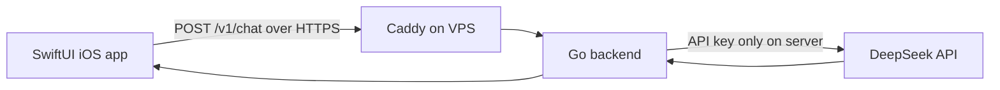

# AI Challenge

Учебное приложение, которое отправляет сообщение в облачную LLM через API и показывает ответ в iOS-интерфейсе.

Пользовательский DeepSeek API key хранится только на backend. В iOS-приложение он не попадает.

## Архитектура



### Backend

```text
backend/
├── cmd/api/                 Composition root and server lifecycle
└── internal/
    ├── domain/              Domain models
    ├── application/         Use cases and ports
    ├── infrastructure/      DeepSeek REST client
    ├── transport/http/      HTTP handlers and middleware
    └── config/              Environment configuration
```

### iOS

```text
ios/AIChallenge/
├── App/                     Composition root
├── Core/                    Configuration and HTTP client
├── Domain/                  Models, repository protocol, use case
├── Data/                    DTO, API and repository implementation
└── Features/Chat/           @Observable view model and SwiftUI views
```

Зависимости iOS направлены внутрь:

```text
ChatScreen → ChatViewModel → SendMessageUseCase
           → ChatRepository protocol ← DefaultChatRepository
                                      → ChatAPI → HTTPClient
```

## Стек

- Go 1.27, стандартная библиотека, `net/http`;
- DeepSeek Chat Completions REST API;
- Docker Compose и Caddy;
- Swift 6, SwiftUI, Observation, Swift Concurrency;
- iOS 17+;
- XcodeGen;
- Go Testing и Swift Testing;
- GitHub Actions для backend.

## API

Проверка состояния не требует авторизации:

```http
GET /health
```

Запрос к модели:

```http
POST /v1/chat
Authorization: Bearer <APP_ACCESS_TOKEN>
Content-Type: application/json

{
  "message": "Объясни простыми словами, что такое LLM"
}
```

Ответ:

```json
{
  "answer": "LLM — это большая языковая модель...",
  "model": "deepseek-v4-flash",
  "usage": {
    "promptTokens": 24,
    "completionTokens": 42,
    "totalTokens": 66
  }
}
```

## Локальный запуск backend

Создайте конфигурацию, которая игнорируется Git:

```bash
cp .env.example .env
openssl rand -hex 32
```

Запишите DeepSeek API key и сгенерированный `APP_ACCESS_TOKEN` в `.env`, затем:

```bash
cd backend
set -a
source ../.env
set +a
go run ./cmd/api
```

В другом терминале:

```bash
curl http://127.0.0.1:8080/health
```

```bash
curl http://127.0.0.1:8080/v1/chat \
  -H "Authorization: Bearer <APP_ACCESS_TOKEN>" \
  -H "Content-Type: application/json" \
  -d '{"message":"Привет! Объясни, что такое LLM."}'
```

## Запуск iOS

Создайте локальную конфигурацию приложения:

```bash
cd ios
cp Config/Secrets.xcconfig.local.example Config/Secrets.xcconfig.local
```

Для локального backend оставьте:

```xcconfig
API_BASE_URL = http:/$()/127.0.0.1:8080
APP_ACCESS_TOKEN = <тот же токен, что и в backend .env>
```

Сгенерируйте проект и откройте его:

```bash
xcodegen generate
open AIChallenge.xcodeproj
```

Файл `Secrets.xcconfig.local` игнорируется Git.

## Деплой на VPS

На сервере должны быть установлены Git, Docker Engine и Docker Compose plugin.

```bash
git clone https://github.com/eugeneappledev-source/AI-Challenge.git
cd AI-Challenge
cp .env.example .env
nano .env
docker compose -f deploy/compose.yaml --env-file .env up -d --build
```

До подключения домена используется:

```env
SERVER_ADDRESS=http://176.53.173.246
```

Проверка:

```bash
curl http://176.53.173.246/health
```

После настройки DNS замените значение на домен без схемы:

```env
SERVER_ADDRESS=api.example.com
```

и примените конфигурацию:

```bash
docker compose -f deploy/compose.yaml --env-file .env up -d
```

Caddy автоматически получит и будет обновлять HTTPS-сертификат.

## Проверки

Backend:

```bash
cd backend
go test ./...
go vet ./...
```

iOS:

```bash
cd ios
xcodegen generate
xcodebuild \
  -project AIChallenge.xcodeproj \
  -scheme AIChallenge \
  -destination 'generic/platform=iOS Simulator' \
  CODE_SIGNING_ALLOWED=NO \
  build
```

## Секреты

Не добавляйте в Git:

- `.env`;
- `DEEPSEEK_API_KEY`;
- `APP_ACCESS_TOKEN`;
- `Secrets.xcconfig.local`;
- приватные SSH-ключи.

`APP_ACCESS_TOKEN` защищает учебный endpoint от случайного публичного использования, но токен внутри клиентского приложения не является полноценной пользовательской авторизацией. Для production-сервиса потребуется отдельная схема аутентификации и rate limiting.
