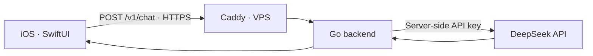

# AI Challenge

iOS-чат, который отправляет запрос в облачную LLM через собственный Go backend и показывает ответ в SwiftUI-интерфейсе.

**Результат задания:** пользователь вводит сообщение в приложении, backend передаёт его в DeepSeek API, а полученный ответ возвращается и отображается на экране.

[](https://github.com/eugeneappledev-source/AI-Challenge/actions/workflows/backend.yml)

Живой health endpoint: [https://176-53-173-246.sslip.io/health](https://176-53-173-246.sslip.io/health)

## Что реализовано

- нативный iOS-клиент на SwiftUI;
- слоистая архитектура `Domain / Data / Presentation`;
- Go REST API с endpoint `POST /v1/chat`;
- интеграция с облачной моделью `deepseek-v4-flash`;
- DeepSeek API key хранится только на сервере;
- авторизация клиентских запросов через Bearer token;
- деплой на VPS в Docker Compose;
- HTTPS и reverse proxy через Caddy;
- unit-тесты backend и iOS;
- GitHub Actions для backend.

## Как это работает



DeepSeek API key никогда не передаётся в iOS-приложение и не хранится в репозитории.

## Стек

### iOS

- Swift 6;
- SwiftUI;
- Observation (`@Observable`);
- Swift Concurrency;
- URLSession;
- iOS 17+;
- XcodeGen и Swift Testing.

### Backend и инфраструктура

- Go 1.27 и `net/http`;
- DeepSeek Chat Completions API;
- Docker Compose;
- Caddy;
- Ubuntu VPS;
- GitHub Actions.

## Структура проекта

```text
AI-Challenge/
├── backend/
│   ├── cmd/api/                  # запуск HTTP-сервера
│   └── internal/
│       ├── domain/               # модели предметной области
│       ├── application/          # сценарии использования
│       ├── infrastructure/       # клиент DeepSeek API
│       ├── transport/http/       # handlers и middleware
│       └── config/               # конфигурация окружения
├── ios/
│   ├── AIChallenge/
│   │   ├── App/                  # composition root
│   │   ├── Core/                 # конфигурация и networking
│   │   ├── Domain/               # модели, repository, use case
│   │   ├── Data/                 # DTO, API и repository implementation
│   │   └── Features/Chat/        # ViewModel и SwiftUI views
│   └── AIChallengeTests/
└── deploy/                       # Docker Compose и Caddy
```

Зависимости iOS направлены к доменному слою:

```text
ChatScreen → ChatViewModel → SendMessageUseCase
           → ChatRepository ← DefaultChatRepository
                            → ChatAPI → HTTPClient
```

## API

### Проверка состояния

```http
GET /health
```

```json
{"status":"ok"}
```

### Запрос к LLM

```http
POST /v1/chat
Authorization: Bearer <APP_ACCESS_TOKEN>
Content-Type: application/json

{
  "message": "Объясни простыми словами, что такое LLM"
}
```

```json
{
  "answer": "LLM — это большая языковая модель...",
  "model": "deepseek-v4-flash",
  "usage": {
    "promptTokens": 24,
    "completionTokens": 42,
    "totalTokens": 66
  }
}
```

## Запуск

### Backend

```bash
cp .env.example .env
docker compose -f deploy/compose.yaml --env-file .env up -d --build
```

В `.env` необходимо указать `DEEPSEEK_API_KEY`, `APP_ACCESS_TOKEN` и публичный адрес сервера.

### iOS

```bash
cd ios
cp Config/Secrets.xcconfig.local.example Config/Secrets.xcconfig.local
xcodegen generate
open AIChallenge.xcodeproj
```

В `Secrets.xcconfig.local` указываются HTTPS-адрес backend и тот же `APP_ACCESS_TOKEN`.

## Проверки

```bash
cd backend
go test ./...
go vet ./...
```

```bash
cd ios
xcodebuild \
  -project AIChallenge.xcodeproj \
  -scheme AIChallenge \
  -destination 'generic/platform=iOS Simulator' \
  CODE_SIGNING_ALLOWED=NO \
  build
```

## Безопасность

`.env`, `Secrets.xcconfig.local`, API keys, access tokens и приватные SSH-ключи исключены из Git. Публичный backend работает только через HTTPS; DeepSeek API key используется исключительно на VPS.
