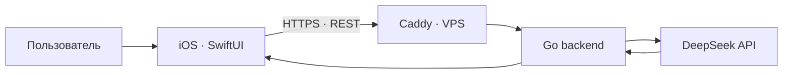

# AI Advent Challenge #9

### Практический путь от первого запроса к LLM до полноценного AI-продукта

[](https://github.com/eugeneappledev-source/AI-Challenge/actions/workflows/backend.yml)


Этот репозиторий — мой практический дневник **AI Advent Challenge, поток 9**. Здесь одно приложение постепенно развивается вместе с заданиями курса: от минимальной интеграции с облачной моделью до более сложной архитектуры, инфраструктуры и пользовательских сценариев.

## Прогресс

| Неделя | День | Задание | Результат | Статус |
|:---:|:---:|---|---|:---:|
| 1 | [01](challenges/day-01/README.md) | Первый запрос к облачной LLM | SwiftUI + Go + DeepSeek + VPS | ✅ |
| 1 | [02](challenges/day-02/README.md) | Управление форматом ответа | Сравнение свободного и контролируемого ответов | ✅ |

Подробная навигация по выполненным заданиям находится в [дневнике челленджа](challenges/README.md).

## Текущая версия проекта

Нативное iOS-приложение работает как пищевой AI-ассистент и отправляет один запрос в собственный Go backend в двух режимах. Сервер получает свободный и контролируемый ответы DeepSeek, а SwiftUI-интерфейс позволяет сравнить их с помощью сегмента. Контролируемый JSON декодируется в типизированную модель и отображается как готовая карточка с ингредиентами и шагами; исходный ответ модели остаётся рядом для наглядного сравнения. Вопросы вне темы еды получают вежливый отказ.

Проект уже развёрнут на VPS и доступен по HTTPS.

**Live health check:** [https://176-53-173-246.sslip.io/health](https://176-53-173-246.sslip.io/health)

## Архитектура



## Структура

```text
AI-Challenge/
├── ios/                         # iOS-приложение
├── backend/                     # Go REST API
├── deploy/                      # Docker Compose и Caddy
├── challenges/                  # дневник выполненных заданий
│   ├── day-01/                  # первый запрос к LLM
│   └── day-02/                  # контроль формата и длины ответа
└── .github/workflows/           # автоматические проверки
```

Рабочий код остаётся в стабильных каталогах `ios`, `backend` и `deploy`, а каждый новый день получает отдельную страницу в `challenges`. Благодаря этому проект может последовательно развиваться без копирования одинаковых исходников.

## Технологии

### iOS

- Swift 6 и SwiftUI;
- Observation и Swift Concurrency;
- URLSession;
- слои `Domain / Data / Presentation`;
- Swift Testing;
- iOS 17+.

### Backend и инфраструктура

- Go и `net/http`;
- DeepSeek Chat Completions API;
- Docker Compose;
- Caddy и HTTPS;
- Ubuntu VPS;
- GitHub Actions.

## Задания

Каждая завершённая работа получает:

- отдельное описание в `challenges/day-XX`;
- ссылки на относящиеся к заданию части проекта;
- зафиксированный результат и способ проверки;
- Git-тег, сохраняющий состояние проекта на момент сдачи.

Первое решение зафиксировано тегом [`day-01`](https://github.com/eugeneappledev-source/AI-Challenge/tree/day-01).
