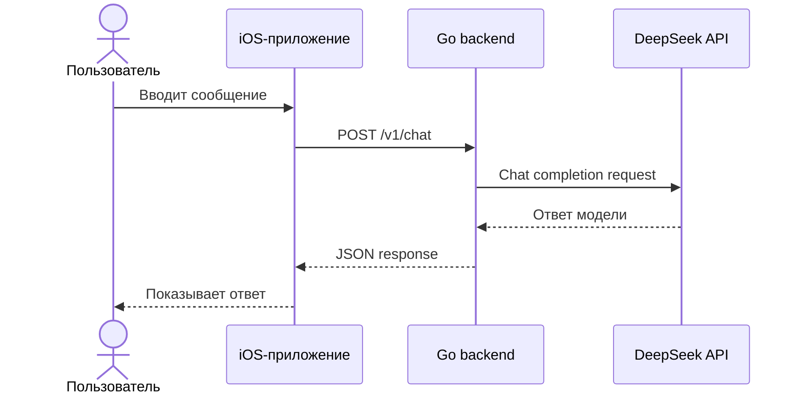

# День 01 — Первый запрос к LLM

[← К списку заданий](../README.md) · [Главная страница проекта](../../README.md)

- **Дата:** 31 августа 2026
- **Статус:** выполнено ✅

## Задание

Создать минимальное приложение, которое:

1. отправляет запрос в облачную LLM через API;
2. получает ответ модели;
3. выводит результат в CLI, Web или пользовательском интерфейсе.

## Результат

Вместо минимального CLI реализован полноценный сквозной сценарий:

- пользователь вводит сообщение в нативном iOS-приложении;
- SwiftUI-клиент отправляет HTTPS-запрос на VPS;
- Go backend формирует запрос к DeepSeek;
- ответ модели возвращается в приложение и появляется в чате.

- **Модель:** `deepseek-v4-flash`
- **Live API:** [https://176-53-173-246.sslip.io/health](https://176-53-173-246.sslip.io/health)

## Поток запроса



## Реализация

### iOS

SwiftUI-приложение построено на слоистой архитектуре:

```text
ChatScreen → ChatViewModel → SendMessageUseCase
           → ChatRepository ← DefaultChatRepository
                            → ChatAPI → HTTPClient
```

- интерфейс чата на SwiftUI;
- `@Observable` ViewModel;
- async/await для сетевого запроса;
- отдельные DTO, repository и use case;
- обработка загрузки и ошибок.

### Backend

Go-сервис разделён по ответственности:

```text
cmd/api              запуск и lifecycle сервера
internal/domain      модели
internal/application бизнес-сценарий
internal/transport   HTTP API
internal/infrastructure/deepseek
```

- `GET /health` для проверки состояния;
- `POST /v1/chat` для запроса к модели;
- валидация входных данных;
- тайм-ауты и graceful shutdown;
- подсчёт использованных токенов.

### Инфраструктура

- Ubuntu VPS;
- Docker Compose;
- Caddy reverse proxy;
- публичный HTTPS endpoint;
- GitHub Actions для тестов backend.

## API-контракт

```http
POST /v1/chat
Authorization: Bearer <access-token>
Content-Type: application/json

{
  "message": "Что такое LLM?"
}
```

```json
{
  "answer": "LLM — это большая языковая модель...",
  "model": "deepseek-v4-flash",
  "usage": {
    "promptTokens": 24,
    "completionTokens": 42,
    "totalTokens": 66
  }
}
```

## Код

- [iOS-приложение](../../ios)
- [Go backend](../../backend)
- [Docker и Caddy](../../deploy)
- [Backend CI](../../.github/workflows/backend.yml)

## Проверка результата

- реальный запрос из iOS успешно получает ответ DeepSeek;
- публичный health endpoint возвращает `{"status":"ok"}`;
- Go unit-тесты и `go vet` проходят;
- iOS-проект собирается для Simulator;
- GitHub Actions завершён успешно.

Состояние проекта на момент сдачи сохранено в теге [`day-01`](https://github.com/eugeneappledev-source/AI-Challenge/tree/day-01).
