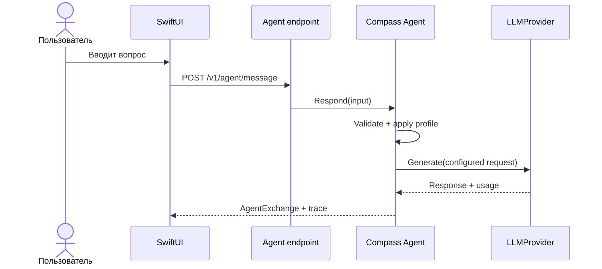

# День 06 — Первый агент

[← К списку заданий](../README.md) · [Главная страница проекта](../../README.md)

- **Дата:** 7 сентября 2026
- **Статус:** выполнено ✅
- **Зафиксированная версия:** [`day-06`](https://github.com/eugeneappledev-source/AI-Challenge/tree/day-06)

## Задание

Создать отдельную сущность агента, которая принимает запрос пользователя, инкапсулирует логику обращения к LLM через API и возвращает ответ в интерфейс.

## Результат

В Go backend появился самостоятельный `Agent`, а в каталоге iOS — экран **«День 6»** с агентом Compass. Пользователь вводит любой вопрос и видит ответ модели, профиль агента и прозрачный trace обработки запроса.

Главное отличие от Дня 1: раньше use case напрямую передавал текст в общий LLM-клиент. Теперь HTTP-handler знает только интерфейс `AgentService`, а сам агент владеет своей ролью, системной инструкцией, моделью, температурой, лимитом ответа, валидацией и порядком вызова провайдера. Конструктор позволяет создавать несколько агентов с разными профилями.



## API

```http
GET /v1/agent
Authorization: Bearer <access-token>
```

Возвращает публичный профиль агента. Для выполнения запроса:

```http
POST /v1/agent/message
Authorization: Bearer <access-token>
Content-Type: application/json

{ "message": "Объясни простыми словами, что делает AI-агент" }
```

Ответ содержит профиль, нормализованное сообщение пользователя, ответ агента, usage модели и trace из четырёх этапов. В День 6 запросы намеренно независимы: долговременная история появляется в следующем задании.

## Как проверить

1. Запустить backend.
2. Открыть iOS-приложение и выбрать **День 6 · Первый агент**.
3. Ввести собственный вопрос.
4. После ответа раскрыть карточку **«Как агент обработал последний запрос»**.

## Код

- [Сущность Agent](../../backend/internal/application/agent.go)
- [Модели агента](../../backend/internal/domain/agent.go)
- [HTTP endpoint](../../backend/internal/transport/http/handler.go)
- [SwiftUI-экран](../../ios/AIChallenge/Features/Agent/Views/AIAgentScreen.swift)
- [iOS use case](../../ios/AIChallenge/Domain/UseCases/TalkToAgentUseCase.swift)
- [Backend-тесты](../../backend/internal/application/agent_test.go)
