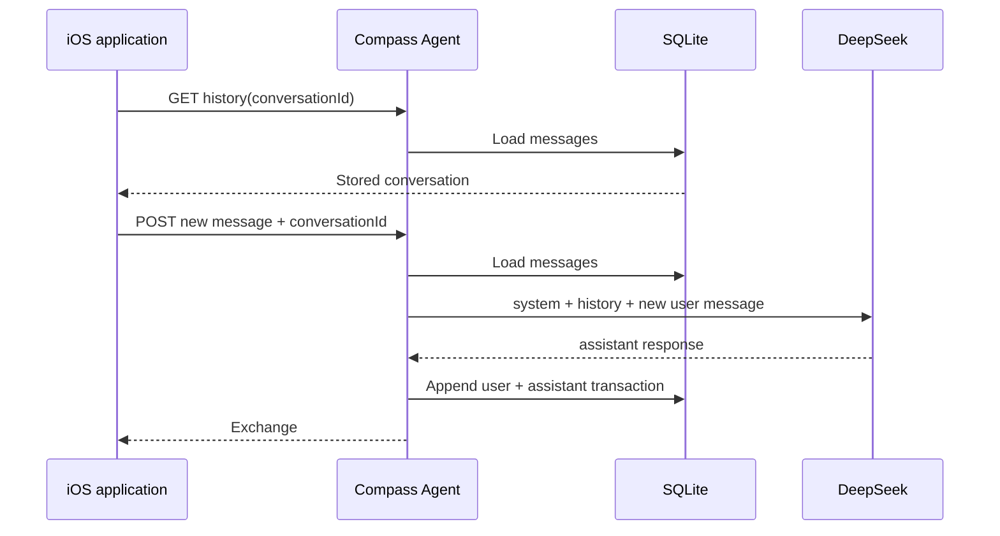

# День 07 — Сохранение контекста

[← К списку заданий](../README.md) · [Главная страница проекта](../../README.md)

- **Дата:** 8 сентября 2026
- **Статус:** выполнено ✅
- **Зафиксированная версия:** [`day-07`](https://github.com/eugeneappledev-source/AI-Challenge/tree/day-07)

## Задание

Научить агента сохранять историю диалога в JSON или SQLite, восстанавливать её после перезапуска и продолжать общение с учётом прошлых сообщений.

## Результат

Compass получил постоянную память на backend:

- каждая завершённая пара `user / assistant` сохраняется транзакцией в SQLite;
- iOS хранит стабильный `conversationId`, но не подменяет серверную историю локальным кэшем;
- при открытии экрана история загружается заново через API;
- перед следующим обращением к DeepSeek агент формирует `messages`: system prompt → восстановленная история → новое сообщение;
- Docker volume сохраняет базу при пересоздании контейнера;
- историю можно очистить из интерфейса.

DeepSeek Chat API не хранит диалог на стороне модели: для многоходового разговора приложение повторно передаёт предыдущие сообщения. Поэтому память реализована внутри агента, а не ожидается от LLM.

## Поток восстановления



## API

- `GET /v1/agent/history?conversationId=...` — восстановить диалог;
- `POST /v1/agent/message` с `conversationId` — продолжить диалог;
- `DELETE /v1/agent/history?conversationId=...` — очистить память.

```json
{
  "conversationId": "ios-67f…",
  "message": "Как меня зовут и какой язык я люблю?"
}
```

## Как снять проверочное видео

1. Открыть **День 7** и написать: «Меня зовут Женя, мой любимый язык — Swift».
2. Дождаться ответа и полностью закрыть приложение.
3. Снова открыть **День 7** — прежние сообщения восстановятся.
4. Спросить: «Как меня зовут и какой язык я люблю?».
5. Для более строгой проверки можно перезапустить Docker-контейнер между шагами 2 и 3.

## Код

- [Оркестрация памяти в Agent](../../backend/internal/application/agent.go)
- [SQLite store](../../backend/internal/infrastructure/sqlite/conversation_store.go)
- [Docker volume](../../deploy/compose.yaml)
- [iOS-экран](../../ios/AIChallenge/Features/AgentMemory/Views/AgentMemoryScreen.swift)
- [Use case](../../ios/AIChallenge/Domain/UseCases/ContinueAgentConversationUseCase.swift)
- [Тест восстановления SQLite](../../backend/internal/infrastructure/sqlite/conversation_store_test.go)
