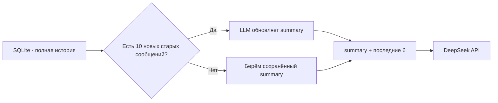

# День 09 — Управление контекстом: сжатие истории

[← К списку заданий](../README.md) · [Главная страница проекта](../../README.md)

- **Дата:** 10 сентября 2026
- **Статус:** выполнено ✅
- **Зафиксированная версия:** [`day-09`](https://github.com/eugeneappledev-source/AI-Challenge/tree/day-09)

## Задание

Хранить последние N сообщений без изменений, заменять старую историю отдельным summary, передавать его модели вместо полного диалога и сравнить качество и расход токенов с несжатым вариантом.

## Результат

Compass получил стратегию управляемого контекста:

- полная история продолжает храниться в `agent_messages` и доступна для аудита;
- summary хранится отдельно в `agent_summaries` вместе с количеством покрытых сообщений;
- первое summary создаётся, когда накопились 10 старых сообщений сверх свежего окна;
- старые сообщения сжимаются пакетами по 10, минимум 6 последних всегда передаются дословно;
- рабочий контекст строится как `system prompt + summary + recent messages + current message`;
- iOS визуально показывает, сколько сообщений вошло в summary и сколько осталось как есть.

## Архитектура контекста



Summary не заменяет архив. Он является отдельной проекцией истории только для экономного LLM-контекста. Поэтому данные не теряются безвозвратно, а стратегию можно сравнить с полной историей в любой момент.

## Честное сравнение

Экран отправляет один и тот же контрольный вопрос дважды при одинаковых модели, system prompt, температуре и лимите:

1. `full` — вся история;
2. `compressed` — summary и свежий несжатый хвост истории (минимум 6 сообщений).

Затем третий, независимый вызов получает оба ответа без подсказки победителя и возвращает структурированный фидбек:

- сохранено ли качество;
- чем отличаются ответы;
- когда сжатие стоит применять.

На экране одновременно видны реальные `prompt_tokens` обоих вариантов, абсолютная экономия и процент сокращения.

## API

- `POST /v1/agent/message` с `compression: true` — продолжить разговор через управляемый контекст;
- `GET /v1/agent/context?conversationId=...` — получить summary и метрики;
- `POST /v1/agent/context/compare` — выполнить A/B-сравнение и AI-рецензию.

```json
{
  "conversationId": "ios-day09-...",
  "question": "Какие мои цели и предпочтения ты запомнил?"
}
```

## Как проверить

1. Открыть **День 9 · Сжатие истории**.
2. Нажать **«Демо-контекст»** — приложение создаст девять реальных обменов с безопасным вымышленным профилем.
3. Убедиться, что появилась отдельная сохранённая сводка и схема `summary + recent`.
4. Нажать **«Сравнить и получить AI-фидбек»**.
5. Показать два ответа, их `prompt_tokens`, экономию и вердикт рецензента.

## Код

- [Алгоритм сжатия и сравнения](../../backend/internal/application/agent.go)
- [Отдельное хранение summary](../../backend/internal/infrastructure/sqlite/conversation_store.go)
- [HTTP API](../../backend/internal/transport/http/handler.go)
- [SwiftUI Context Lab](../../ios/AIChallenge/Features/ContextCompression/Views/ContextCompressionScreen.swift)
- [Use case](../../ios/AIChallenge/Domain/UseCases/ManageCompressedContextUseCase.swift)
- [Тесты summary и A/B-сравнения](../../backend/internal/application/agent_test.go)
