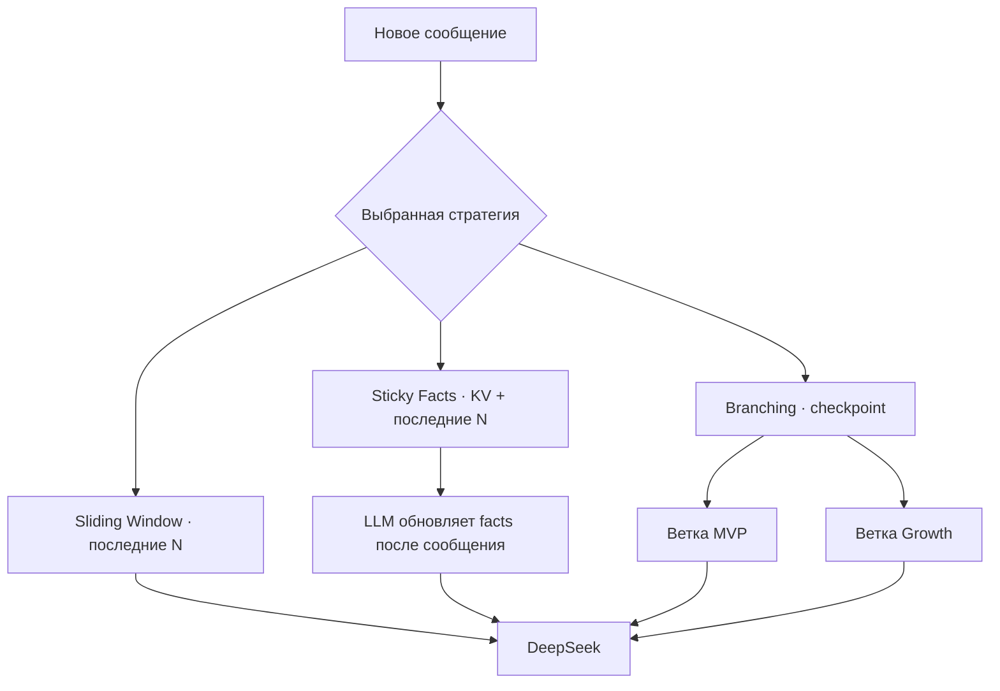

# День 10 — Стратегии управления контекстом без summary

[← К списку заданий](../README.md) · [Главная страница проекта](../../README.md)

- **Дата:** 12 сентября 2026
- **Статус:** выполнено ✅
- **Зафиксированная версия:** [`day-10`](https://github.com/eugeneappledev-source/AI-Challenge/tree/day-10)

## Задание

Реализовать в агенте минимум три переключаемые стратегии — Sliding Window, Sticky Facts и Branching — прогнать один сценарий на каждой и сравнить качество, стабильность, токены и удобство.

## Результат

В Compass появился отдельный **Context Strategies Lab**:

- переключатель стратегии работает как часть агента, а не как UI-декорация;
- размер окна `N` выбирается в интерфейсе (`4 / 6 / 10`) и передаётся в backend как часть API-запроса;
- `Sliding Window` физически удаляет всё, кроме последних `N` сообщений;
- `Sticky Facts` после каждого пользовательского сообщения обновляет отдельный JSON key-value блок в SQLite и отправляет `facts + последние N сообщений`;
- `Branching` клонирует checkpoint основной истории в ветки `MVP` и `Growth`, после чего они продолжаются независимо;
- сравнительный прогон учитывает полный расход токенов стратегии, включая служебные вызовы обновления facts и обе ветки;
- отдельный LLM-рецензент оценивает все варианты вслепую по четырём критериям.

Summary из Дня 9 здесь намеренно не используется.

## Как устроены стратегии



### Sliding Window

После каждого обмена SQLite-записи обрезаются до последних `N` сообщений. Доступны учебные значения `4`, `6` и `10`, а API принимает любое `N` от `2` до `20`; при отсутствии параметра используется `6`. Новое значение применяется до следующего LLM-вызова, поэтому модель сразу получает выбранное окно. Это самый простой и предсказуемый по стоимости вариант, но отброшенные сведения восстановить невозможно.

### Sticky Facts

Перед основным ответом отдельный структурированный вызов получает текущие facts и новое сообщение пользователя, возвращая полный актуальный объект `string:string`. Он хранится отдельно от последних `N` сообщений. Это не summary: сохраняется не пересказ разговора, а адресные значения вроде `platform`, `deadline`, `privacy_constraint`.

### Branching

Пользователь сначала ведёт основную ветку, затем создаёт checkpoint. Агент копирует одинаковую историю в `MVP` и `Growth`; новые сообщения записываются только в активную ветку. Переключение не объединяет и не загрязняет истории.

## Единый эксперимент

Сценарий — сбор ТЗ для вымышленного iOS-приложения **PulsePlan**:

1. четыре общих пользовательских сообщения задают продукт, платформу, offline/privacy и срок;
2. ещё два сообщения задают функции и доступность — итого 12 сообщений вместе с ответами агента;
3. для Branching от общего checkpoint создаются `MVP` и альтернативная `Growth`-ветка;
4. каждой стратегии задаётся одинаковый финальный вопрос о полном ТЗ;
5. независимый рецензент получает ответы и фактический `usage`.

В расход включён весь прогон: у Facts видна стоимость шести обновлений key-value памяти, а у Branching — стоимость общей истории и двух продолжений. Поэтому метрика честно отражает ресурсоёмкость, а не только последний запрос.

## Проверенный результат

Полный сценарий был выполнен через реальный DeepSeek API 12 сентября 2026 года при `N = 6`:

| Стратегия | Всего токенов | Сохранено | Наблюдение |
|---|---:|---:|---|
| Sliding Window | 1 802 | 6 сообщений | Самая экономная, но потеряла платформу, offline-first и отсутствие регистрации |
| Sticky Facts | 4 511 | 6 сообщений + 12 facts | Сохранила все ключевые требования и дала наиболее полное ТЗ |
| Branching | 3 457 | 2 независимые ветки, 24 сообщения суммарно | Корректно разделила MVP и Growth, но не пытается свести альтернативы в один документ |

AI-рецензент выбрал **Sticky Facts**: качество `9/10`, стабильность `9/10`, удобство `9/10`. Это не универсальный победитель — для короткого дешёвого диалога рациональнее Sliding Window, а для исследования взаимоисключающих решений нужен Branching.

## API

- `POST /v1/agent/strategies/message` — сообщение с выбранными strategy/branch и `windowSize`;
- `GET /v1/agent/strategies/state` — окно, facts или состояние веток; `windowSize` передаётся query-параметром;
- `POST /v1/agent/strategies/branches` — checkpoint и создание `MVP`/`Growth`;
- `POST /v1/agent/strategies/compare` — полный одинаковый эксперимент при выбранном `windowSize` и AI-рецензия;
- `DELETE /v1/agent/strategies` — очистка лаборатории.

```json
{
  "sessionId": "ios-day10-...",
  "strategy": "sticky_facts",
  "windowSize": 4,
  "message": "Срок MVP — шесть недель"
}
```

## Как проверить на видео

1. Открыть **День 10 · Стратегии контекста**.
2. Выбрать `N = 4`, показать размер окна и затем переключить `N = 10`.
3. Переключить `Window / Facts / Ветки` и показать разные состояния памяти.
4. Ввести своё сообщение в Facts и показать появившийся key-value блок.
5. В режиме Ветки добавить общие сообщения, создать checkpoint и продолжить `MVP`/`Growth` разными решениями.
6. Выбрать нужный `N` и нажать **«Прогнать сценарий и сравнить»**.
7. Показать сохранённое в результате значение `N`, ответы, token usage и оценки AI-рецензента.

## Код

- [Оркестрация трёх стратегий](../../backend/internal/application/context_strategy.go)
- [Доменные модели](../../backend/internal/domain/context_strategy.go)
- [SQLite window и facts](../../backend/internal/infrastructure/sqlite/conversation_store.go)
- [HTTP API](../../backend/internal/transport/http/handler.go)
- [SwiftUI Context Strategies Lab](../../ios/AIChallenge/Features/ContextStrategies/Views/ContextStrategiesScreen.swift)
- [ViewModel](../../ios/AIChallenge/Features/ContextStrategies/Presentation/ContextStrategiesViewModel.swift)
- [Use Case](../../ios/AIChallenge/Domain/UseCases/ManageContextStrategiesUseCase.swift)
- [Backend-тесты](../../backend/internal/application/context_strategy_test.go)
- [iOS-тест](../../ios/AIChallengeTests/ContextStrategiesUseCaseTests.swift)
