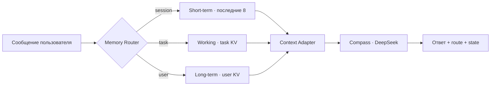

# День 11 — Модель памяти агента

[← К списку заданий](../README.md) · [Главная страница проекта](../../README.md)

- **Дата:** 21 сентября 2026
- **Статус:** выполнено ✅
- **Зафиксированная версия:** [`day-11`](https://github.com/eugeneappledev-source/AI-Challenge/tree/day-11)
- **Интерфейс:** [Web-демо](https://176-53-173-246.sslip.io/#day-11)

## Задание

Реализовать в агенте три разных типа памяти — краткосрочную, рабочую и долговременную — хранить их раздельно и добавить механизм, который решает, куда сохранять новые сведения.

## Результат

В Compass появилась **Layered Memory Lab** с двумя способами маршрутизации:

- `Авто` — отдельный структурированный LLM-вызов классифицирует сообщение по сроку жизни, извлекает key-value факт и объясняет решение;
- ручной выбор — пользователь фиксирует нужный слой, а маршрутизатор нормализует ключ и значение;
- выбранный факт сохраняется до генерации основного ответа;
- Context Adapter собирает долговременную память пользователя, рабочую память задачи и последние сообщения беседы в один запрос;
- интерфейс показывает решение маршрутизатора, ответ агента и фактическое состояние каждого слоя SQLite.

RAG и векторная база намеренно не используются: цель эксперимента — понять жизненный цикл памяти и явную маршрутизацию данных.

## Три слоя

| Слой | Scope | Что хранит | Реализация |
|---|---|---|---|
| Краткосрочная | `sessionId` | Последние 8 сообщений текущей беседы | `agent_messages` |
| Рабочая | `taskId` | Цели, ограничения и решения PulsePlan | `agent_working_memory` |
| Долговременная | `userId` | Устойчивые сведения и предпочтения пользователя | `agent_long_term_memory` |

Рабочие и долговременные записи используют upsert по ключу: новый факт добавляется, а уточнение существующего факта заменяет его актуальным значением. Краткосрочный слой ограничивается при сборке контекста и не загрязняет память других сессий.

## Поток данных



Чувствительные данные не записываются в постоянные слои: инструкция маршрутизатора отправляет их в краткосрочную память с пометкой, что сохранение запрещено.

## Сценарий для проверки

Web-интерфейс содержит четыре готовых шага, но позволяет вводить любые собственные сообщения:

1. сообщить, что пользователь — iOS-разработчик и предпочитает SwiftUI;
2. задать требования проекта PulsePlan: iOS 17, offline-first и VoiceOver;
3. добавить временную реплику только для текущего разговора;
4. спросить агента, что он помнит, и получить решение с учётом всех трёх слоёв.

Для каждого шага видно:

- какой слой был выбран;
- какой ключ и значение извлечены;
- почему маршрутизатор принял такое решение;
- что реально лежит в каждом хранилище после ответа.

## API

- `POST /v1/agent/memory/message` — маршрутизация, запись и ответ агента;
- `GET /v1/agent/memory/state` — текущее состояние трёх слоёв;
- `DELETE /v1/agent/memory` — полная очистка демонстрационного сценария.

```json
{
  "sessionId": "browser-id:day11",
  "taskId": "browser-id:pulse-plan",
  "userId": "browser-id",
  "layer": "auto",
  "message": "PulsePlan должен работать offline-first"
}
```

Публичный Web вызывает `/web-api/...`; Caddy добавляет серверный access token, поэтому секрет не попадает в JavaScript и DevTools браузера.

## Как записать видео

1. Открыть [Web-демо Дня 11](https://176-53-173-246.sslip.io/#day-11).
2. Нажать **«Очистить все слои»** и показать три пустые карточки.
3. Последовательно выбрать примеры `1 · Пользователь`, `2 · Задача`, `3 · Реплика` и отправить каждый.
4. После каждого ответа показать выбранный слой и появившиеся записи.
5. Отправить `4 · Проверка` и показать, что ответ использует профиль, условия задачи и текущую беседу.
6. Раскрыть **«Как был собран контекст»**.

## Код

- [Оркестрация и маршрутизация памяти](../../backend/internal/application/layered_memory.go)
- [Доменные модели](../../backend/internal/domain/agent.go)
- [Три SQLite-хранилища](../../backend/internal/infrastructure/sqlite/conversation_store.go)
- [HTTP API](../../backend/internal/transport/http/handler.go)
- [React-экран Layered Memory Lab](../../web/src/MemoryLab.tsx)
- [Web API-клиент](../../web/src/api.ts)
- [Backend-тесты](../../backend/internal/application/agent_test.go)
