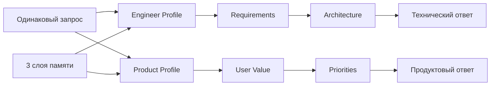

# День 12 — Персонализация ассистента

[← К списку заданий](../README.md) · [Главная страница проекта](../../README.md)

- **Дата:** 21 сентября 2026
- **Статус:** выполнено ✅
- **Зафиксированная версия:** [`day-12`](https://github.com/eugeneappledev-source/AI-Challenge/tree/day-12)
- **Интерфейс:** [Web-демо](https://176-53-173-246.sslip.io/#day-12)

## Задание

Добавить персонализацию поверх модели памяти: создать профиль пользователя, описать стиль, формат и ограничения, подключать профиль к каждому запросу и сравнить ответы для разных профилей.

## Результат

Compass получил отдельную сущность **UserProfile**, которая не смешивается с памятью:

- пользователь выбирает и редактирует название, обращение, стиль, формат ответа и ограничения;
- профиль хранится в отдельной SQLite-таблице `agent_profiles`;
- каждый профиль выбирает собственный pipeline навыков;
- backend автоматически подключает профиль, рабочую память задачи, долговременные факты и краткосрочную историю к каждому запросу;
- A/B-режим отправляет один и тот же запрос через два профиля и показывает отличия рядом;
- в интерфейсе видны реальные промежуточные этапы pipeline, финальные ответы и token usage.

## Профиль и память — разные сущности

| Сущность | За что отвечает | Как меняется |
|---|---|---|
| Память | Что агент накопил о пользователе, задаче и диалоге | Пополняется во время общения |
| Профиль | Как агент должен работать для конкретной задачи | Настраивается пользователем |

На уровне LLM обе сущности участвуют в формировании контекста, но имеют разный жизненный цикл и разные таблицы хранения. Очистка диалога не удаляет профиль, а редактирование профиля не переписывает факты памяти.

## Два профиля

### Senior iOS Engineer

- технический и лаконичный стиль;
- формат `Решение → Почему → Риски → Следующий шаг`;
- ограничения iOS 17+, SwiftUI, Swift Concurrency, offline-first и VoiceOver;
- pipeline: **Проверка требований → Архитектурная проверка → Финальный ответ**.

### Product Mentor

- понятный язык без лишнего технического жаргона;
- формат `Ценность → MVP → Метрика → Эксперимент`;
- лимит 180 слов и один проверяемый следующий шаг;
- pipeline: **Ценность пользователя → Приоритизация → Финальный ответ**.

Профили используют одинаковую модель, исходный запрос и память. Поэтому разница в результате создаётся именно конфигурацией оркестрации.

## Поток запроса



Перед pipeline входящее сообщение также проходит Memory Router Дня 11. Это показывает, что персонализация действительно добавлена поверх модели памяти, а не заменяет её.

## API

- `GET /v1/agent/profiles?userId=...` — список профилей; при первом запросе создаёт два безопасных шаблона;
- `PUT /v1/agent/profiles` — сохранение пользовательской конфигурации;
- `POST /v1/agent/personalized/message` — профильный pipeline, память и финальный ответ.

```json
{
  "sessionId": "browser-id:day12:engineer",
  "taskId": "browser-id:pulse-plan",
  "userId": "browser-id",
  "profileId": "engineer",
  "message": "Предложи архитектуру и план MVP для PulsePlan"
}
```

## Как записать видео

1. Открыть [День 12](https://176-53-173-246.sslip.io/#day-12).
2. Переключить `Senior iOS Engineer / Product Mentor` и показать, что меняются стиль, формат, ограничения и pipeline.
3. Изменить любое поле, например обращение, и нажать **«Сохранить профиль»**.
4. Оставить один запрос в A/B-форме и нажать **«Сравнить профили»**.
5. Показать два разных финальных ответа на один запрос.
6. В каждой карточке раскрыть этапы pipeline и показать, что оба ответа используют task facts и user facts из памяти.

## Код

- [Оркестрация профилей и навыков](../../backend/internal/application/personalization.go)
- [Доменные модели](../../backend/internal/domain/agent.go)
- [SQLite-профили](../../backend/internal/infrastructure/sqlite/conversation_store.go)
- [HTTP API](../../backend/internal/transport/http/handler.go)
- [React Profile Lab](../../web/src/ProfileLab.tsx)
- [Web API-клиент](../../web/src/api.ts)
- [Backend-тесты](../../backend/internal/application/agent_test.go)
