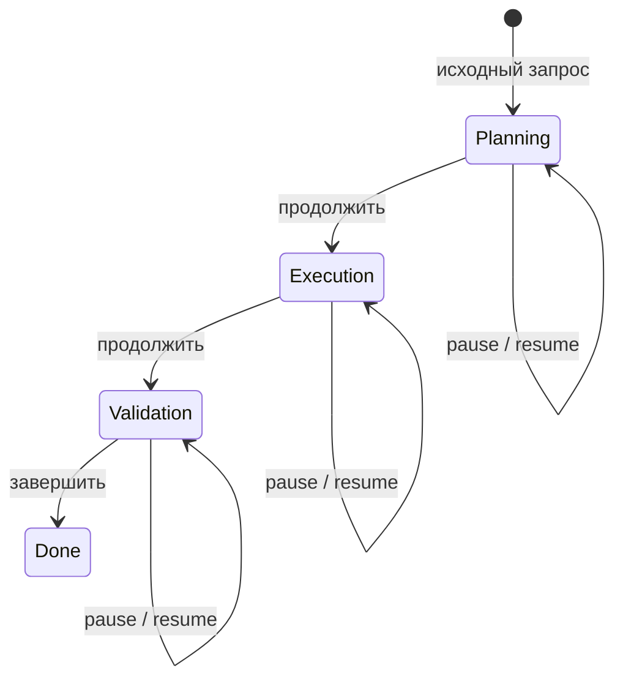

# День 13 — Состояние задачи (Task State Machine)

[← К списку заданий](../README.md) · [Главная страница проекта](../../README.md)

- **Дата:** 21 сентября 2026
- **Статус:** выполнено ✅
- **Зафиксированная версия:** [`day-13`](https://github.com/eugeneappledev-source/AI-Challenge/tree/day-13)
- **Интерфейс:** [Web-демо](https://176-53-173-246.sslip.io/#day-13)

## Задание

Формализовать состояние задачи как конечный автомат: хранить этап, текущий шаг и ожидаемое действие; поддержать паузу на любом рабочем этапе и продолжение без повторного объяснения задачи.

## Результат

Compass получил отдельную сущность **TaskState**, которая хранится в SQLite и не зависит от открытой страницы браузера:

- исходный пользовательский запрос создаёт объект задачи и переводит его в `planning`;
- backend последовательно управляет этапами `planning → execution → validation → done`;
- у каждого состояния есть `currentStep` и `expectedAction`;
- результат каждого этапа сохраняется как отдельный artifact;
- команда `pause` фиксирует точку остановки без вызова LLM;
- после обновления страницы или перезапуска агента команда `resume` восстанавливает цель, этап, шаг и предыдущие artifacts;
- LLM выполняет работу внутри текущего этапа, но не управляет состоянием автомата самостоятельно.

## Что хранится в состоянии

```json
{
  "phase": "execution",
  "status": "paused",
  "currentStep": "Подготовить архитектурное решение и шаги реализации",
  "expectedAction": "Возобновите задачу — повторно объяснять контекст не нужно",
  "artifacts": [
    { "phase": "planning", "title": "План и критерии успеха" }
  ],
  "revision": 3
}
```

Task State хранится отдельно от трёх слоёв памяти Дня 11 и профиля Дня 12. При LLM-вызове backend собирает их вместе, но жизненный цикл задачи остаётся детерминированным.

## Поток задачи



Пауза не меняет этап: она сохраняет `phase`, `currentStep`, `expectedAction` и artifacts. Resume загружает тот же объект из SQLite и подставляет его в следующий запрос к модели.

## API

- `POST /v1/agent/tasks` — создать задачу и выполнить planning;
- `GET /v1/agent/tasks/state?taskId=...` — восстановить состояние;
- `POST /v1/agent/tasks/action` — выполнить `advance`, `pause` или `resume`;
- `DELETE /v1/agent/tasks?taskId=...` — удалить состояние и начать заново.

Пример команды:

```json
{
  "taskId": "browser-id:pulse-plan",
  "action": "pause"
}
```

## Как записать видео

1. Открыть [День 13](https://176-53-173-246.sslip.io/#day-13).
2. Показать цель и нажать **«Создать задачу»** — появится этап Planning, текущий шаг и ожидаемое действие.
3. Нажать **«Перейти к выполнению»** — этап станет Execution, а planning-артефакт останется внизу.
4. Нажать **«Поставить на паузу»** и показать, что этап и текущий шаг не изменились.
5. Обновить страницу браузера: состояние загрузится из SQLite всё ещё на паузе.
6. Нажать **«Продолжить без объяснений»** — ничего заново не вводить. В ответе агент назовёт восстановленный контекст.
7. Перейти в Validation, затем Done, показать журнал переходов и четыре artifacts.

Главное доказательство задания — шаги 4–6: задача продолжается после перезагрузки без повторного описания.

## Код

- [Конечный автомат и orchestration](../../backend/internal/application/task_state_machine.go)
- [Доменные модели состояния](../../backend/internal/domain/task.go)
- [SQLite persistence](../../backend/internal/infrastructure/sqlite/conversation_store.go)
- [HTTP API](../../backend/internal/transport/http/handler.go)
- [React Task State Lab](../../web/src/TaskStateLab.tsx)
- [Web API-клиент](../../web/src/api.ts)
- [Тесты pause/restart/resume](../../backend/internal/application/task_state_machine_test.go)
- [Тест восстановления SQLite](../../backend/internal/infrastructure/sqlite/conversation_store_test.go)
