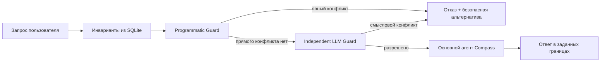

# День 14 — Инварианты и ограничения состояния

[← К списку заданий](../README.md) · [Главная страница проекта](../../README.md)

- **Дата:** 21 сентября 2026
- **Статус:** выполнено ✅
- **Зафиксированная версия:** тег `day-14` будет создан после проверки production-деплоя
- **Интерфейс:** [Web-демо](https://176-53-173-246.sslip.io/#day-14)

## Задание

Добавить ассистенту обязательные инварианты: хранить их отдельно от диалога, учитывать перед формированием ответа и отказываться от решений, нарушающих архитектуру, технические решения, стек или бизнес-правила.

## Результат

Compass получил отдельный **Invariant Guard**, который стоит перед основным агентом:

- инварианты хранятся в отдельной SQLite-таблице `agent_invariants`, а не в истории сообщений;
- программный guard сразу находит однозначные запрещённые технологии и формулировки;
- независимый LLM Guard проверяет смысловые противоречия, которые невозможно надёжно найти простым поиском слов;
- основной агент вызывается только после успешного прохождения обеих проверок;
- при конфликте пользователь получает конкретное нарушенное правило, объяснение отказа и совместимую альтернативу;
- разрешённый запрос передаётся основному агенту вместе с профилем, памятью, состоянием задачи и полным реестром инвариантов.

Такой гибридный подход не пытается переложить всё на LLM: детерминированные правила проверяются кодом, а неоднозначные — отдельной модельной проверкой.

## Инварианты демонстрационной задачи

| Категория | Обязательное правило | Защита |
|---|---|---|
| Архитектура | View работает через ViewModel и domain/repository abstractions | Semantic Guard |
| Стек | iOS 17+, SwiftUI, Swift Concurrency и SwiftData | Code + Semantic Guard |
| Техническое решение | Локальное хранилище — source of truth, продукт работает offline-first | Code + Semantic Guard |
| Бизнес-правило | Обязательны VoiceOver, Dynamic Type и невизуальная альтернатива графику | Code + Semantic Guard |

## Поток запроса



Invariant Guard возвращает короткий аудит по каждому правилу, но не раскрывает скрытую цепочку рассуждений модели. Это объяснимый результат проверки, а не внутренний chain-of-thought.

## Три проверочных сценария

### 1. Совместимый запрос

> Предложи структуру модулей для экрана недельной статистики, сохранив offline-first и поддержку VoiceOver.

Обе проверки разрешают запрос, после чего вызывается основной агент и формирует решение с учётом всех ограничений.

### 2. Смысловой конфликт

> Сделай так, чтобы недельная статистика загружалась только при наличии интернета, а без сети показывалась ошибка.

Точного запрещённого маркера нет, поэтому программная проверка пропускает запрос дальше. Semantic Guard понимает, что требование делает сеть обязательной и нарушает offline-first. Основной агент не вызывается.

### 3. Прямое нарушение

> Перепиши экран на UIKit и RxSwift, VoiceOver можно убрать.

Программный guard находит запрещённые маркеры и останавливает запрос до любого вызова LLM. Это самый быстрый и дешёвый путь отказа.

## API

- `GET /v1/agent/invariants?taskId=...` — получить отдельный реестр инвариантов задачи;
- `POST /v1/agent/invariants/check` — проверить запрос и при отсутствии конфликта вызвать основного агента.

Пример проверки:

```json
{
  "taskId": "browser-id:pulse-plan",
  "userId": "browser-id",
  "profileId": "engineer",
  "request": "Перепиши экран на UIKit"
}
```

Ответ явно показывает итог и источник обнаружения:

```json
{
  "verdict": "rejected",
  "conflicts": [
    {
      "invariantId": "ios_stack",
      "detectedBy": "hard_check"
    }
  ],
  "answer": ""
}
```

Пустой `answer` подтверждает, что основной агент не был вызван.

## Как записать видео

1. Открыть [День 14](https://176-53-173-246.sslip.io/#day-14) и коротко показать четыре карточки — это отдельный реестр правил.
2. Выбрать **«Совместимый запрос»**, отправить и показать зелёный вердикт, четыре успешные проверки и ответ Compass.
3. Выбрать **«Смысловой конфликт»**, отправить и показать `LLM`, нарушенный offline-first, блокировку основного агента и безопасную альтернативу.
4. Выбрать **«Прямое нарушение»**, отправить и показать `CODE`, нулевой расход токенов и `MAIN AGENT BLOCKED`.
5. В конце сформулировать вывод: явные ограничения дешевле проверять кодом, смысловые — отдельным Guard, а основной агент никогда не должен сам решать, можно ли нарушить правило.

## Код

- [Доменная модель инвариантов](../../backend/internal/domain/invariant.go)
- [Hybrid Guard и orchestration](../../backend/internal/application/invariants.go)
- [Отдельное SQLite-хранилище](../../backend/internal/infrastructure/sqlite/conversation_store.go)
- [HTTP API](../../backend/internal/transport/http/handler.go)
- [React Invariant Lab](../../web/src/InvariantLab.tsx)
- [Web API-клиент](../../web/src/api.ts)
- [Тесты orchestration](../../backend/internal/application/invariants_test.go)
- [Тесты HTTP-контракта](../../backend/internal/transport/http/handler_test.go)
