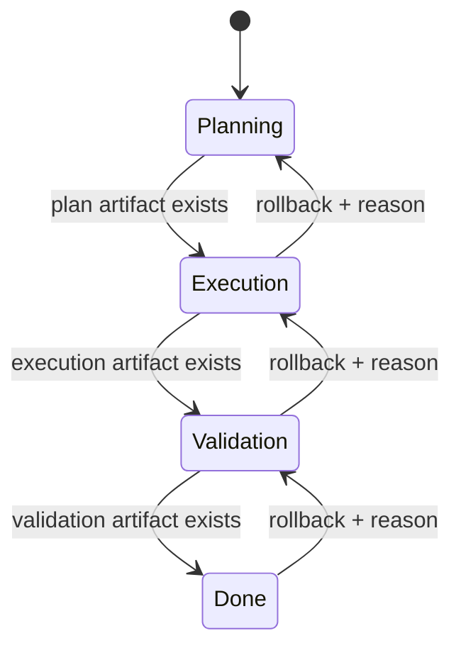
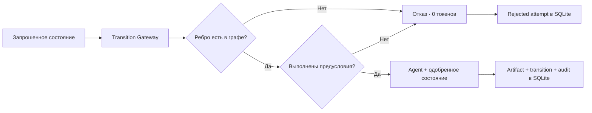

# День 15 — Контролируемые переходы состояний

[← К списку заданий](../README.md) · [Главная страница проекта](../../README.md)

- **Дата:** 21 сентября 2026
- **Статус:** выполнено ✅
- **Зафиксированная версия:** тег `day-15` будет создан после проверки production-деплоя
- **Интерфейс:** [Web-демо](https://176-53-173-246.sslip.io/#day-15)

## Задание

Реализовать явные состояния и разрешённые переходы между ними. Ассистент не должен перепрыгивать этапы: реализация невозможна до утверждённого плана, а финал — до валидации. Нужно проверить недопустимые переходы, реакцию ассистента и корректное продолжение после паузы.

## Результат

Жизненный цикл задачи Compass теперь защищён единым **Transition Gateway**:

- допустимые состояния и рёбра заданы в backend как явный граф;
- запрос перехода всегда проходит через один gateway до вызова LLM;
- модель получает только уже одобренное целевое состояние и не может выбрать этап самостоятельно;
- переход вперёд требует артефакт текущего этапа;
- попытка перепрыгнуть этап, повторить состояние или перейти во время паузы отклоняется без вызова модели;
- rollback разрешён только по обратному ребру графа и с указанной причиной;
- разрешённые и отклонённые попытки сохраняются в SQLite для аудита;
- после паузы задача продолжает работу с тем же этапом и накопленными артефактами.

День 13 показывал **happy path** конечного автомата. День 15 добавляет **красный путь**: систему нельзя сломать просьбой «игнорируй стадии», недопустимым состоянием или попыткой перейти через этап.

## Явный граф



Других рёбер нет. Например, `planning → validation` и `execution → done` всегда блокируются. Пауза не является новым этапом: она закрывает все рёбра до команды `resume`, сохраняя текущую фазу.

## Правила gateway

| Проверка | Решение | Вызов LLM | Изменение этапа |
|---|---|:---:|:---:|
| Соседнее forward-ребро и есть артефакт | Разрешить | Да | Да |
| Прыжок через этап | `transition_not_allowed` | Нет | Нет |
| Задача на паузе | `task_paused` | Нет | Нет |
| Повтор текущего состояния | `same_state` | Нет | Нет |
| Forward без артефакта | `phase_artifact_required` | Нет | Нет |
| Rollback без причины | `rollback_reason_required` | Нет | Нет |
| Обратное ребро и указана причина | Разрешить | Да | Да |

Отклонённый переход возвращает `STATE UNCHANGED`, расходует `0` токенов и всё равно записывается в журнал попыток. Так отказ становится проверяемым результатом, а не скрытой веткой интерфейса.

## Поток перехода



## API

- `GET /v1/agent/tasks/graph` — получить полный граф и требования к рёбрам;
- `POST /v1/agent/tasks/transition` — запросить конкретное целевое состояние;
- `POST /v1/agent/tasks/action` — поставить задачу на паузу или возобновить её;
- `GET /v1/agent/tasks/state?taskId=...` — восстановить состояние и аудит;
- `POST /v1/agent/tasks` — создать задачу с обязательного этапа `planning`;
- `DELETE /v1/agent/tasks?taskId=...` — сбросить демонстрационную задачу.

Пример запроса, который будет заблокирован на этапе `planning`:

```json
{
  "taskId": "browser-id:controlled-lifecycle",
  "target": "validation",
  "reason": "Пользователь просит перескочить этап"
}
```

Ответ содержит текущее состояние и причину отказа:

```json
{
  "allowed": false,
  "code": "transition_not_allowed",
  "requestedFrom": "planning",
  "requestedTo": "validation",
  "usage": { "totalTokens": 0 }
}
```

## Как записать видео

1. Открыть [День 15](https://176-53-173-246.sslip.io/#day-15), показать явный граф и создать задачу — она всегда начинает с `Planning`.
2. Нажать **«Попробовать запрещённый переход»** (`planning → validation`). Показать `STATE UNCHANGED`, код `transition_not_allowed`, `0` токенов и запись в аудите.
3. Выполнить разрешённый переход `planning → execution`. Показать `STATE CHANGED`, новый артефакт и разрешённую запись аудита.
4. Поставить задачу на паузу и попытаться перейти в `validation`. Gateway вернёт `task_paused`, состояние останется `execution`.
5. Нажать **«Возобновить»**, затем перейти в `validation` без повторного описания задачи.
6. Ввести причину и выполнить rollback `validation → execution`. Показать, что возврат идёт только по обратному ребру и создаёт новый артефакт доработки.
7. Сформулировать вывод: LLM выполняет работу этапа, но жизненным циклом управляет детерминированный backend, поэтому перепрыгнуть или сломать маршрут нельзя.

## Код

- [Явный граф и Transition Gateway](../../backend/internal/application/controlled_transitions.go)
- [Базовый Task State Machine](../../backend/internal/application/task_state_machine.go)
- [Доменные модели графа и аудита](../../backend/internal/domain/task.go)
- [HTTP API](../../backend/internal/transport/http/handler.go)
- [React Controlled Lifecycle Lab](../../web/src/ControlledLifecycleLab.tsx)
- [Web API-клиент](../../web/src/api.ts)
- [Тесты разрешённых и запрещённых переходов](../../backend/internal/application/controlled_transitions_test.go)
- [Тест HTTP-контракта](../../backend/internal/transport/http/handler_test.go)
