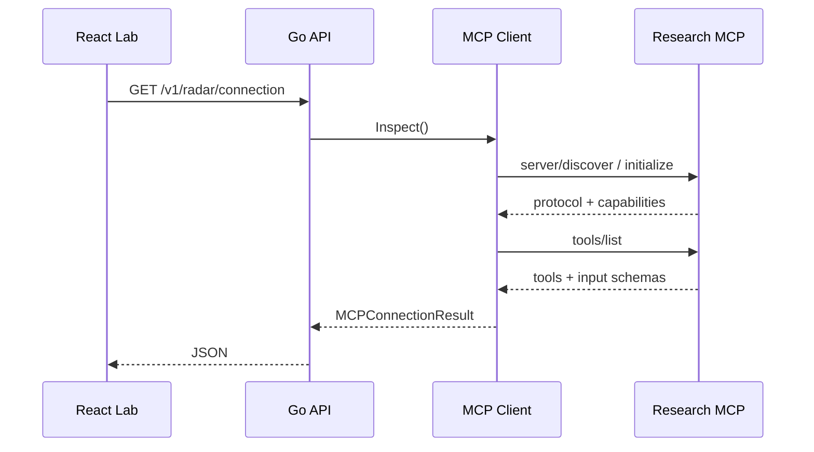

# День 16 — Подключение MCP

## Задача

Подключить MCP-клиент, установить соединение с сервером и получить список доступных инструментов.

## Реализация

Начинается новая лаборатория **Startup & Business Radar**. Backend использует официальный Go SDK Model Context Protocol и поднимает доверенный read-only MCP-сервер через Streamable HTTP. Приложение не подменяет протокол собственным REST-контрактом: MCP-клиент проходит lifecycle negotiation и выполняет стандартный запрос `tools/list`.

На странице видны состояние соединения, согласованная версия MCP, имена клиента и сервера, транспорт, зарегистрированные инструменты, JSON Schema входных параметров и последовательность handshake → `tools/list` → результат.

## Поток

## Как записать видео

1. Открыть [День 16](https://176-53-173-246.sslip.io/#day-16).
2. Показать зелёный статус `MCP подключён`, сервер `startup-research-mcp` и согласованную версию протокола.
3. Показать инструмент `describe_business_radar` и раскрыть его `Input schema`.
4. Нажать **«Повторить tools/list»** и показать четыре этапа трассировки.
5. Сделать вывод: приложение устанавливает реальное MCP-соединение и динамически получает схемы инструментов, а не хранит их в интерфейсе.

## Код

- [MCP-клиент и tools/list](../../backend/internal/application/mcp_connection.go)
- [Доверенный MCP-сервер](../../backend/internal/infrastructure/mcpserver/research.go)
- [Доменные модели результата](../../backend/internal/domain/mcp.go)
- [HTTP endpoint](../../backend/internal/transport/http/handler.go)
- [React MCP Connection Lab](../../web/src/StartupRadarLab.tsx)
- [Интеграционный тест MCP](../../backend/internal/application/mcp_connection_test.go)

## Источники

- [Official MCP Go SDK](https://github.com/modelcontextprotocol/go-sdk)
- [MCP Streamable HTTP specification](https://modelcontextprotocol.io/specification/2026-07-28/basic/transports)
